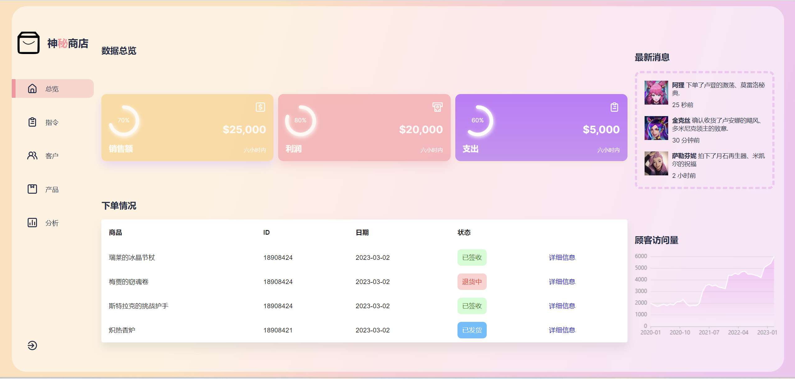
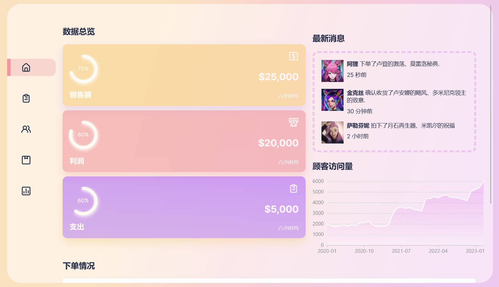
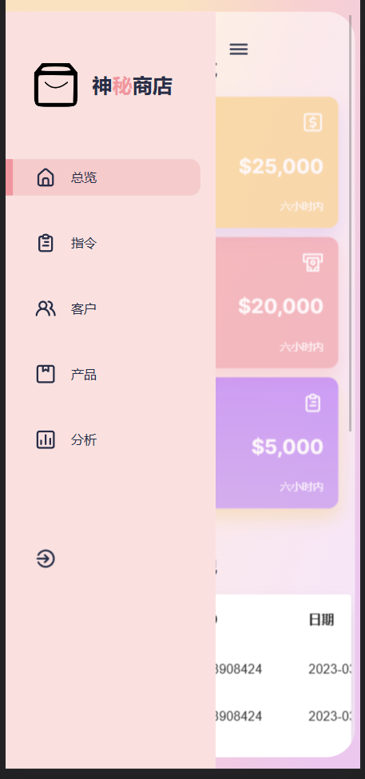

# React-Admin-Dashboard-Page
 

 

## 技术栈：
- React、React Hooks、Javascript 
- CSS、Framer Motion
- Apex Charts、AntV、Material UI、iconscout
- 媒体查询响应式设计
## 预览

### 视频预览：https://www.bilibili.com/video/BV1qc411L7yR/?share_source=copy_web&vd_source=bf005d0d0ad6ce1c53742985c3786c8e
### web端

### IPAD

### Iphone

## 使用用法：
### yarn 
### yarn start 

