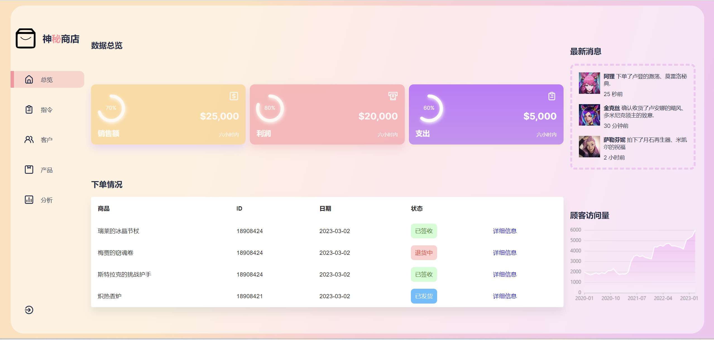
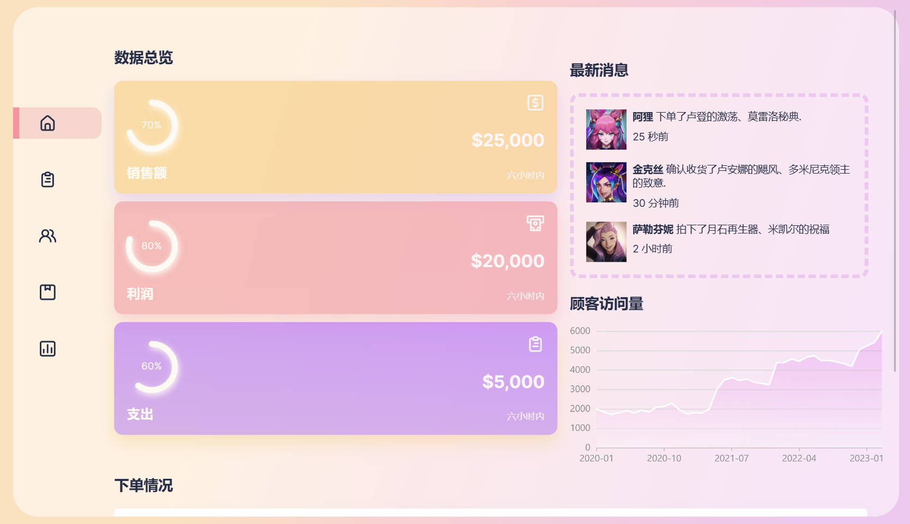
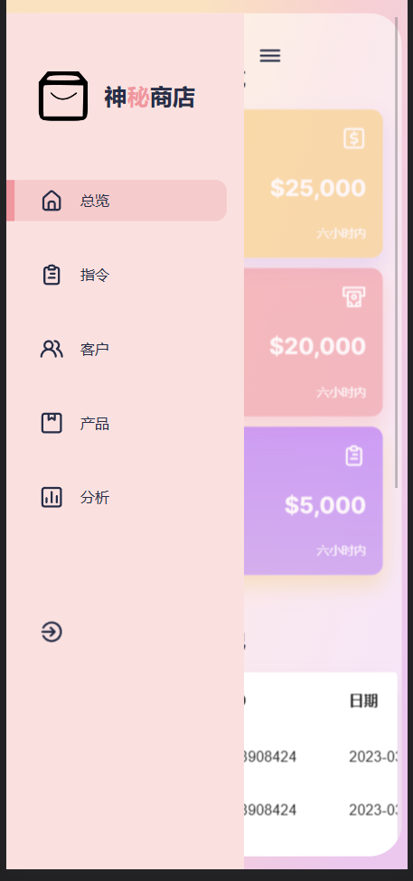

# React-Admin-Dashboard-Page

### 技术栈：
React、React Hooks、Javascript 、CSS、Framer Motion、 Apex Charts、AntV、Material UI、媒体查询响应式设计、iconscout
### 预览
#### 视频预览：https://www.bilibili.com/video/BV1qc411L7yR/?share_source=copy_web&vd_source=bf005d0d0ad6ce1c53742985c3786c8e
#### web端

#### IPAD

#### Iphone

### 用法：
#### yarn (安装依赖)
#### yarn start  
Runs the app in the development mode. 
Open http://localhost:3000 to view it in your browser.
The page will reload when you make changes.
You may also see any lint errors in the console.
#### yarn test  
Launches the test runner in the interactive watch mode.
See the section about running tests for more information.
#### yarn build  
Builds the app for production to the build folder. 
It correctly bundles React in production mode and optimizes the build for the best performance. 
The build is minified and the filenames include the hashes. 
Your app is ready to be deployed!

